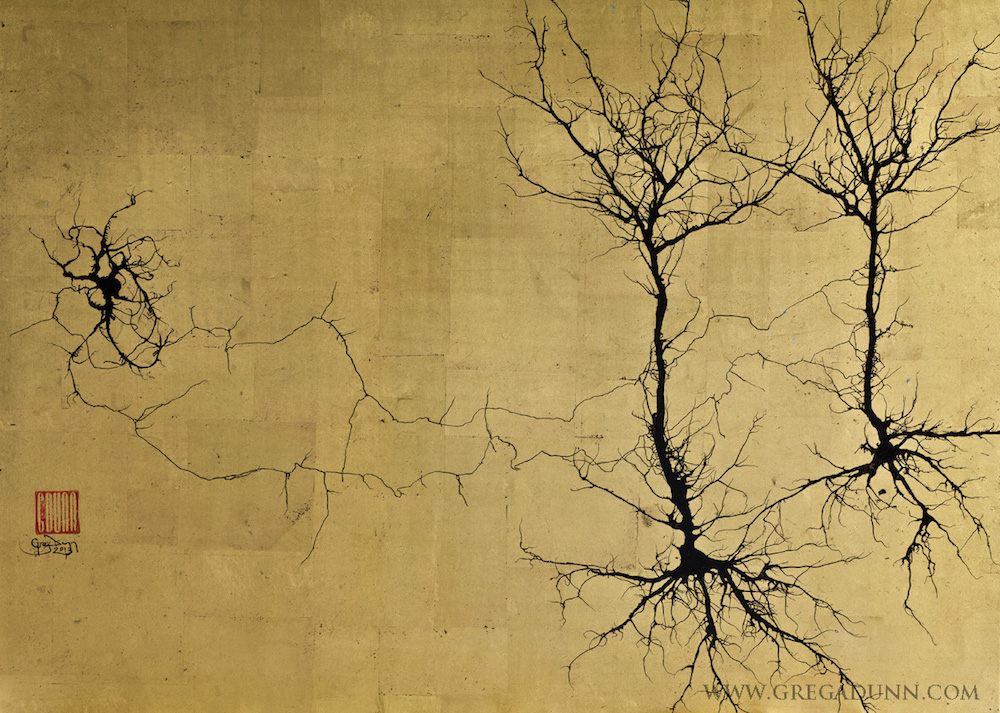

Voici mon jardin virtuel !

Après avoir essayer d'organiser mes projets, site webs, notes et lien de différentes manières, j'ai abouti à la conclusion qu'il serait bien plus simple et efficace de tout mettre sur Obscidian et d'en faire un espace de mon site dhammacharts.org.

Je tente alors de regrouper dans ce "vault" toutes les parties de esprit pour y garder une trace et arriver enfin a organiser d'une manière organique tous les neurones de ce petit crane ;-)

# Categories
---
Using tags ? 

# Projets en cours
---
## Traduction du Sutta Pitaka
Former un groupe pour réaliser la traduction du sutta pitaka à l'aide de Bilara, le logiciel de traduction assisité créé par Bhante Sujato.

## Création du site DhammaCharts.org
[dhammachart](projects/dhammachart.md)
Mettre à jour les fichier et finaliser le site web.

## Gérer le serveur "Dhamma en français"
Mettre en place et promulgé le nouveau serveur pour mettre en contact les moines et pratiquant laîcs du Dhamma

## Relecture de traductions
Relir et éditer des traductions du Dhamma
- Dhamma Within Reach = Le Dhamma à protée de main
- Path to Nibbana 

## Développement du site AudioSutta.org
Site web dédié à l'écoute des suttas du Bouddha en français.

## Dhamma Vault
[dhamma vault](projects/dhamma%20vault.md)
Création d'une base de donnée à l'aide d'Obsidian et de Quartz pour la creation de diagramme

Un mini abidhamma personnel.

# Perso
---
## Biographie
## Photos

# Projets réalisés
---
## sanghadelaforet.org
Mise en place du site web et connection aux outils média sociaux

## Feuilles Jaunes - Enseignements d'Ajahn Jayasaro
[Feulles Jaunes](projects/Feulles%20Jaunes.md)
Mise en place du site web et connection aux outils média sociaux

## foresthermitage.org.uk
Mise en place du site web et connection aux outils média sociaux

# Archive
---
[code](code/code.md)

